# MMTC: Multi-Mission Time Correlation

The Multi-Mission Time Correlation (MMTC) application is a NASA AMMOS component developed by Johns Hopkins Applied Physics Laboratory (JHU/APL) that provides an automated system for correlating spacecraft clock (SCLK) values with ground time. MMTC is designed to be mission-independent and adaptable to different spacecraft and ground systems, intended for operation in Mission Operations Centers (MOCs) or Mission Support Areas (MSAs).

## Purpose and Functionality

MMTC serves several critical functions in spacecraft operations:

1. **Time Correlation**: Associates spacecraft clock values with Terrestrial Dynamical Time (TDT) and calculates clock drift rates to enable accurate time mapping between spacecraft and ground systems.

2. **Telemetry Processing**: Extracts timing information from spacecraft telemetry data, applying quality filters to ensure reliable correlation.

3. **Product Generation**: Creates standard time correlation products used by mission operations teams and science data processing:
   - SCLK Kernels for [NAIF SPICE](https://naif.jpl.nasa.gov/naif/)
   - SCLK/SCET (Spacecraft Event Time) files
   - Uplink Command files for clock updates
   - Various analysis tables and reports

4. **Clock Drift Monitoring**: Tracks spacecraft oscillator performance over time, crucial for long-duration missions.

## System Architecture

MMTC is built as a Java command-line application with a modular architecture. Below is an architectural diagram illustrating how MMTC fits into the broader mission operations environment and how its internal components interact.

### Architectural Diagram

```mermaid
%%{init: {
  'theme': 'default',
  'themeVariables': {
    'fontSize': '16px',
    'fontFamily': 'Arial',
    'nodeTextColor': '#000'
  },
  'flowchart': {
    'curve': 'basis',
    'useMaxWidth': true
  }
}}%%

graph TD

    %% Mission Operations Environment
    subgraph "Mission Operations Environment"
        MOT["Mission Operations Team<br><title>Operates the spacecraft and monitors health</title>"]
        DSN["Deep Space Network<br><title>Handles uplink/downlink between ground and spacecraft</title>"]
        SC["Spacecraft<br><title>Receives commands and sends telemetry</title>"]
        GDS["Ground Data System<br><title>Processes data and handles command sequences</title>"]
        SDP["Science Data Processing<br><title>Processes time products and generates science outputs</title>"]
        NAIF["NAIF SPICE System<br><title>Receives SCLK kernels for spacecraft timing</title>"]
        
        SC -->|Telemetry| DSN
        DSN -->|Downlink| GDS
        GDS -->|Commands| DSN
        DSN -->|Uplink| SC
    end

    %% MMTC Application
    subgraph "MMTC Application"
        CLI["Command Line Interface<br><title>User interface to operate MMTC</title>"]
        TelSrc["Telemetry Source<br><title>Aggregates telemetry from multiple plugins</title>"]
        TimeCorr["Time Correlation Engine<br><title>Performs clock correlation and conversion</title>"]
        ProdGen["Product Generation<br><title>Generates time products, summaries, and kernels</title>"]
        Config["Configuration System<br><title>Manages parameter and system configurations</title>"]
        
        CLI -->|Parameters| TimeCorr
        TelSrc -->|Time Samples| TimeCorr
        TimeCorr -->|Correlations| ProdGen
        Config -->|Settings| TimeCorr
        Config -->|Settings| TelSrc
        Config -->|Settings| ProdGen
    end

    %% Telemetry Source Components
    subgraph "Telemetry Source"
        AMPCS["AMPCS Plugin<br><title>Extracts telemetry from AMPCS pipeline</title>"]
        RawTable["Raw Telemetry Table<br><title>Direct access to raw telemetry database</title>"]
        CustomSrc["Custom Source Plugins<br><title>Other user-defined telemetry sources</title>"]
        
        AMPCS --> TelSrc
        RawTable --> TelSrc
        CustomSrc --> TelSrc
    end

    %% Time Correlation Engine Components
    subgraph "Time Correlation Engine"
        SampleProc["Sample Processor<br><title>Initial processing of time samples</title>"]
        FilterChain["Filter Chain<br><title>Applies filters to clean and qualify data</title>"]
        ClockModel["Clock Model<br><title>Builds correlation model for time conversion</title>"]
        TimeConv["Time Conversion<br><title>Generates SCET/SCLK pairs and histories</title>"]
        
        SampleProc --> FilterChain
        FilterChain --> ClockModel
        ClockModel --> TimeConv
        TimeConv --> TimeCorr
    end

    %% Product Generation Components
    subgraph "Product Generation"
        SCLKKernel["SCLK Kernel Generator<br><title>Generates SCLK kernels for NAIF</title>"]
        SCLKSCETFile["SCLK/SCET Generator<br><title>Generates correlation data files</title>"]
        TimeHistory["Time History Generator<br><title>Generates time history plots/files</title>"]
        SummaryTable["Summary Table Generator<br><title>Generates summary views of time quality</title>"]
        UplinkCmd["Uplink Command Generator<br><title>Creates time-based command constraints</title>"]
        
        SCLKKernel --> ProdGen
        SCLKSCETFile --> ProdGen
        TimeHistory --> ProdGen
        SummaryTable --> ProdGen
        UplinkCmd --> ProdGen
    end

    %% Filter Components
    subgraph "Filters"
        ContactFilter["Contact Filter<br><title>Filters telemetry during DSN contact periods</title>"]
        DataRateFilter["Data Rate Filter<br><title>Filters based on telemetry volume</title>"]
        ERTSCLKFilter["ERT/SCLK Filter<br><title>Aligns Earth Received Time with SCLK</title>"]
        TempFilter["Temperature Filter<br><title>Filters data by spacecraft thermal conditions</title>"]
        
        ContactFilter --> FilterChain
        DataRateFilter --> FilterChain
        ERTSCLKFilter --> FilterChain
        TempFilter --> FilterChain
    end

    %% External connections
    GDS -->|Telemetry Data| TelSrc
    ProdGen -->|SCLK Kernels| NAIF
    ProdGen -->|Time Products| SDP
    ProdGen -->|Uplink Commands| GDS
    MOT -->|Operates| CLI
    MOT -->|Configures| Config

```

### Key Components

1. **Core Framework**:
   - Time correlation engine for computing spacecraft-to-ground time relationships
   - Configuration management system for mission-specific adaptations
   - Product generation framework for creating standardized outputs
   - Time system conversion utilities for handling different time references

2. **Telemetry Source Plugins**:
   - AMPCS (AMMOS Mission Data Processing and Control System) plugin for NASA missions
   - Raw Telemetry Table source for direct telemetry access
   - Extensible interface for mission-specific plugins through a well-defined API

3. **Quality Filters**:
   - Contact Filter: Validates clock drift rates during spacecraft contacts
   - ERT/SCLK Filters: Ensures consistency and monotonicity in timing data
   - Data Rate Filters: Validates telemetry rate and identifies anomalies
   - Temperature-based filters: Compensates for oscillator temperature effects on clock drift

4. **Output Product Generators**:
   - SCLK Kernel Generator: Creates SPICE-compatible time correlation kernels
   - SCLK/SCET Generator: Produces mapping files between spacecraft and Earth time
   - Time History File Generator: Records correlation evolution over mission lifetime
   - Summary Table Generator: Creates reports on correlation quality and statistics
   - Uplink Command Generator: Prepares spacecraft clock update commands

5. **Rollback Management**:
   - Provides capabilities to revert to previous versions of correlation products
   - Maintains archive of historical correlation data
   - Supports comparison between multiple correlation periods

### Technical Specifications

- **Implementation Language**: Java 8
- **External Dependencies**: 
  - NAIF SPICE libraries (via JNI interface)
  - Log4j2 for logging
  - Apache Commons for utilities
- **Build System**: Gradle
- **Package Format**: RPM for RHEL 8/9 and tar.gz archive
- **Configuration Format**: XML and CSV files
- **Memory Requirements**: 4GB minimum, 8GB recommended for large datasets

## Data Flow

MMTC processes data through the following workflow:

1. **Data Acquisition**: Telemetry containing spacecraft clock (SCLK) and Earth Receive Time (ERT) values is retrieved from the configured telemetry source.

2. **Filtering & Validation**: Telemetry samples undergo multiple filtering stages to ensure quality:
   - Validation of data format and completeness
   - Elimination of outliers and inconsistent samples
   - Verification of telemetry rates and patterns
   - Assessment of clock stability metrics

3. **Correlation Computation**: Using validated samples, MMTC:
   - Calculates the relationship between SCLK and ground time (TDT)
   - Applies light-time corrections based on spacecraft position
   - Determines clock drift rate and stability
   - Handles spacecraft clock partitions and discontinuities

4. **Product Generation**: Based on computed correlations, MMTC creates:
   - SCLK kernels for SPICE integration
   - SCLK/SCET files for ground system time mapping
   - Analysis tables for performance monitoring
   - Uplink command files for potential clock adjustments

## Operational Workflow

MMTC follows a standard operational process in mission environments:

1. **Configuration**: Mission-specific parameters are set in XML configuration files
2. **Telemetry Query**: MMTC queries specified telemetry source with start/stop times
3. **Data Filtering**: Telemetry samples undergo quality filtering using configurable criteria
4. **Correlation Computation**: Time correlation and clock drift are calculated using selected algorithms
5. **Product Generation**: Standard output products are created for mission consumption
6. **Deployment**: Products are distributed to mission systems according to operational procedures
7. **Monitoring**: Correlation quality and clock performance are continuously monitored

## Clock Change Rate Computation

MMTC offers several methods for computing spacecraft clock change rates:

- **Predicted**: Computes based on current and past time correlations, projecting future behavior
- **Interpolated**: Computes and updates previous correlations (default method)
- **Assigned**: Uses manually specified values from mission operations input
- **No-Drift**: Fixed at 1.0 (assumes perfect clock, useful for testing)

The selection of method depends on mission phase, spacecraft characteristics, and operational requirements.

## Configuration System

MMTC is configured via several files:

- **TimeCorrelationConfigProperties.xml**: Main configuration defining:
  - Telemetry source configuration
  - Filter parameters and thresholds
  - Output product specifications
  - Clock model parameters
  - Processing options
- **GroundStationsMap.csv**: Maps DSN station IDs to SPICE identifiers
- **SclkPartitionMap.csv**: Defines SCLK partitions and reset points
- **log4j2.properties**: Configures logging levels and destinations

## Project Structure

The MMTC codebase is organized into several key areas:

### Primary Components:

- **Core Framework**: Java classes for time correlation calculations and system orchestration
- **Telemetry Handling**: Code for processing spacecraft data from various sources
- **Plugin Architecture**: Extensible system for integration with different telemetry sources
- **Time Conversion Utilities**: Functions for converting between time formats (SCLK, TDT, UTC, etc.)
- **Product Generation**: Creates SCLK kernels and other output files to mission specifications

### File Distribution:

- Java Source Files (`.java`): Core application code organized in a standard package hierarchy
- XML Files (`.xml`): Configuration templates and examples for different mission scenarios
- CSV Files (`.csv`): Mapping tables and sample data for ground stations and SCLK partitions
- Shell Scripts (`.sh`): Startup and utility scripts for operational use
- Test Resources: Various file types for validation and testing, including sample telemetry

## Installation and Deployment

MMTC is distributed in two formats:

1. **RPM Package**: For RHEL 8/9 environments (recommended for operational deployments)
2. **Tar Archive (.tar.gz)**: Platform-independent distribution for other Linux environments

Installation creates a standard directory structure for:
- Configuration files customized for the mission
- Output products organized by type and date
- Log files with configurable verbosity
- Temporary data for processing large telemetry sets

## License and Acknowledgments

MMTC is released under the Apache License 2.0 and was developed by Johns Hopkins University Applied Physics Laboratory for NASA/JPL.

This work was performed for the Jet Propulsion Laboratory, California Institute of Technology, sponsored by the United States Government under the Prime Contract 80NM0018D00004 between Caltech and NASA under subcontract number 1658085.

## Getting Started

For installation instructions, see the [Download](download) page.

For configuration guidance, refer to the [Configuration](configuration) section.

For operational procedures, consult the [User Guide](user).